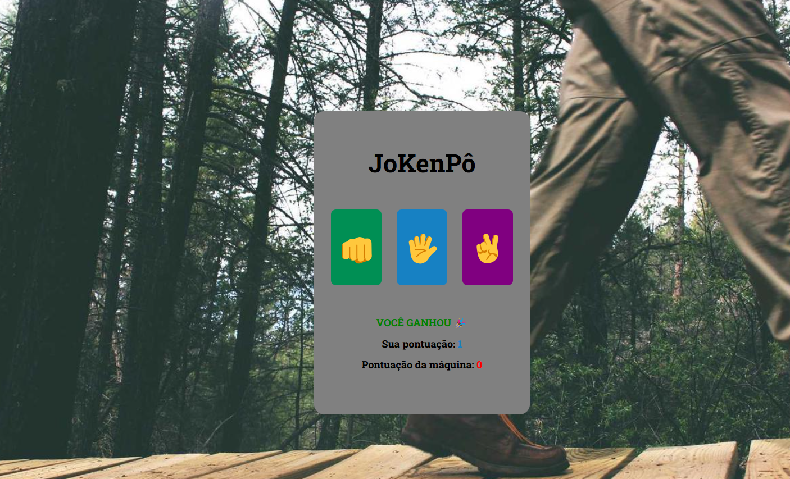

# JoKenPô - Jogo de Pedra, Papel e Tesoura

Um simples jogo de Pedra, Papel e Tesoura implementado com HTML, CSS e JavaScript. Este projeto permite que o jogador jogue contra a máquina, com pontuação e mensagens de resultado (ganhou, perdeu ou empatou) exibidas na tela.

## 🚀 Demonstração



## 🎮 Como Jogar

1. Escolha uma das opções (Pedra 🪨, Papel 📄, ou Tesoura ✂️) clicando no botão correspondente.
2. A máquina faz sua escolha aleatoriamente.
3. O resultado do jogo é exibido, com uma mensagem que informa se você venceu, perdeu ou empatou.
4. A pontuação é atualizada automaticamente para você e para a máquina.

## 📋 Funcionalidades

- Escolha entre Pedra, Papel e Tesoura.
- O resultado é exibido com uma cor específica para cada tipo:
  - **Empate**: Cinza
  - **Vitória**: Verde
  - **Derrota**: Vermelho
- Pontuação acumulativa para o jogador e para a máquina.

## 📂 Estrutura do Projeto

```plaintext
JoKenPo/
├── index.html       # Estrutura principal da aplicação
├── style.css        # Estilos para o layout e cores do jogo
└── script.js        # Lógica do jogo e manipulação de DOM
```
## 🛠️ Tecnologias Utilizadas
- HTML: Estrutura da interface
- CSS: Estilização da interface e cores de feedback
- JavaScript: Lógica do jogo e interação com o usuário